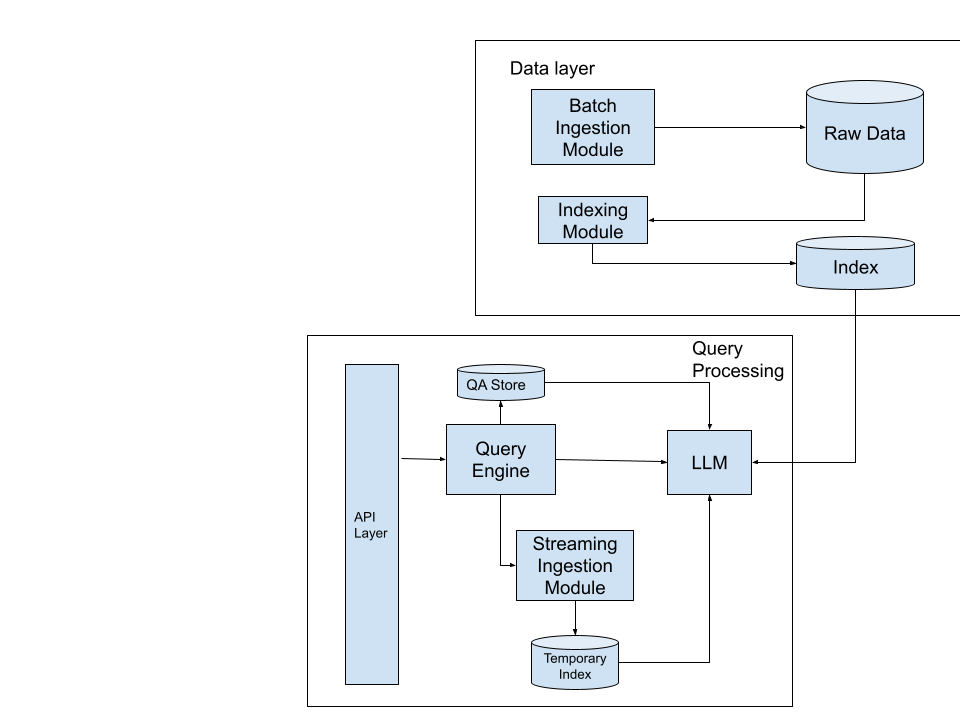

# email-sifter

# Objective

**Give a customer the 4-5 most important things they need to read or action on** based on their recent activity (email, slack, other work apps, etc). Effectively a day planner that requires little intervention from the customer to fill in.

**Questions we’re trying to answer**

* What did they most spend time on last week?
* How does that shape what they’ll do this week?
* Future: Perform each of the recommended actions using the assistant

**Natural Language Interface:**

Question: “Give me the top X things that require my attention”_

Response:

1. Read email, “Urgent: Action needed” from X
2. Work on JIRA-1475
3. Fill in quarterly goals by Friday
4. Bug fix - Deliver by Wednesday

Ideally, each prompt would also include:

* An action that can be performed using the assistant itself. For example, for _Work on CAT-1475_, customers should be able to ask ‘_What’s my current progress on CAT-1475?_’ to get started, which could summarize any related conversations / docs / PRs in progress & propose next steps.
* An time estimate for the actions, if possible & relevant. Not necessary for simple tasks like reading mail, but highly useful for others since engineers spend a decent portion of their time in estimating & then broadcasting their timelines
    * Could also add features like raising an alarm if their other commitments make these tasks unfeasible in the given timeframe. For example, bug fix by Wednesday could include an estimate based on similar Jira tickets/sprint boards in the past & then raise an alarm if your upcoming meetings make it infeasible. 

# Solution

## Potential Data Sources

* Email
    * Batch ingestion from APIs  
* Web Browser data - 
    * A web extension that can monitor open tabs, time spent on pages & general trend lines with your activity at this time of day/week
* Slack:
    * Batch ingestion from APIs 
    * Active slack threads, messages from you where you stated you would deliver something in X time 
* Calendar
    * API integration - We don’t need indexing data in batch, can be added per customer at query time.
* Other work apps will be context specific. Each company & role will have its own set of data sources; easy extensibility of data powering the model is important. For example, for developers, this would include:
    * Open PRs from GitHub or active 
    * Incidents they’re managing (or are relevant) in PagerDuty
    * Kanban boards

## System Requirements

* Easy integration for new data sources. Each data store will be clearly separated in the datastore to preserve privacy
* System should maintain a history of question prompts & answers, keyed by user & session, to feed into the model as context
* A feedback mechanism, which helps evaluate the relevance of the reading/action items produced. 
* Wipeout of data sources and/or customer data (including prompts) if necessary
* A/B test mechanism since we’ll eventually want to test different models & data sources
    * Feature flagging for incremental updates
* Implementation should scale to different interfaces for connecting into a company (customer) ecosystem, via a clear facade layer with separated concerns.

## Open Questions

* How does this app interface with a company’s ecosystem? 
    * Slack bot
    * Email 
* Data privacy -
    * How long can you store this data?
    * How do you ensure granular control over the data & generated indexes? For example, slack private thread information should only be used by the assistant to answer questions if you would already have access to it in the slack workspace. 

## High-level design

**Data ingestion**

* Batch ingestion pipelines for larger data sources. For example, company-wide information sources like slack, internal wikis, jira, etc for pre-indexing.
* Streaming data for user-specific (and potentially PII) contexts like calendar, browsing history, etc at query time. This data is cached for very small periods.

**Query Processing**

* Client APIs feed into an eval module which:
    * Generates (if required) a temporary index using PII for use by the module
    * Call the underlying model. In the future, this could scale to a chain of recursive calls to the model to perform a series of steps or answer a series of questions to give an accurate day planner summary.

**Feedback**

We want to collect data early from users to iterate on the model & actionability of items. Some potential means to get this feedback:

* Along with the answers, potentially include a UI that customers can provide early feedback from. Along the lines of, to the “Was this useful question?” that Google sometimes asks on search results. Store results with the question/answer db so the model can train on this offline.
* Collect metrics from the actions suggested. For example, time spent on reading the email & any subsequent links. 

**Wipeout**

Expose client-facing APIs to delete data sources and/or individual users. This API can feed into a SQS (or any other message queuing) so that the wipeout can be handled. This would ideally require:

* The index to be separated by datasource, otherwise everytime we delete, we’ll need to recreate the index. 
* Model retrain on wipeout

**Model Training**

Periodic training of the model (for example, daily), including versioning for reproducibility. 

Open Questions:

* Does the model need to be retrained from scratch every time? 
* Or only fed incremental data updates?

## Implementation
Implements an email based LangChain example. Very slimmed down version of this design with
* Data ingestion from Gmail
* Index based on stored emails
* Train an LLM & query it 
